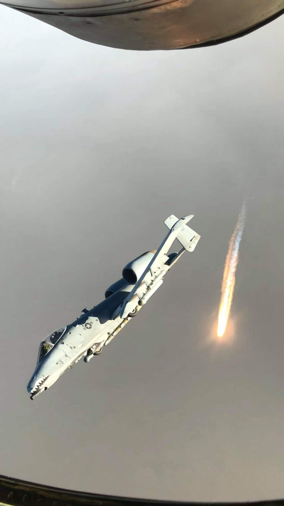

<html>
<header>
<title> 
    Hard Knox Life
</title>

</header>
<body style="background-color:burlywood;">

<header>
<h1 style="color:rgb(95, 27, 2);"> Hard Knox Life</h1>
</header>

<fieldset>
    <legend style="color:rgb(95, 27, 2);"><big><big><b>About This Site</b></big></big></legend>
        <em>
This page is where I'll practice the basics of HTML, Javascript and CSS as I learn. Expect simple updates as I get more comfortable adding new features.
</em>
</fieldset>

<fieldset>
    <legend style="color:rgb(95, 27, 2);"><big><big><b>Bio</b></big></big></legend>
        
&nbsp;&nbsp;&nbsp;&nbsp;When it comes to a little about myself, one of the most important things is my career in the military. Starting out as an eighteen-year-old fresh out of high school with no
        experience of how the world works, the military threw me into a whirlwind of experiences that jump-started my knowledge of the world, surpassing that of my peers close to my 
        age. By the age of 25, I had traveled around the globe, with multiple deployments to the Pacific military theater and the sandy, desolate regions of Afghanistan, gathering 
        a lifetime of memories of the people I met and experiences that I will cherish for a lifetime. Although this type of service is not for everyone, I am proud to be one of the 
        1% who are able to serve and appreciate anyone who has or had any aspirations to join.

            

        
&nbsp;&nbsp;&nbsp;&nbsp; With the financial security provided by the military during the turbulent times of the 2008 recession and housing crash, the opportunities afforded by this security enabled me 
        to expand my interests and hobbies, and to discover what life means in adulthood.  While continuing to build on the skills learned from the military by rebuilding crashed 
        cars from my '96 Camaro, to deep engine repair, to my VW TDI Jetta. Childhood interests continued to grow from macro photography and astrophotography to movies and video games.

            
            

        
&nbsp;&nbsp;&nbsp;&nbsp; Subsequently, the military is not all-encompassing of who I am. With the newfound freedom from the constant rule of my parents and my mother’s dislike of dogs, I found my first 
        dog, Pepper, in the newspaper. Yup, I’m officially old! Following in my footsteps with a love for dogs is my twin sister. My girlfriend at the time told me about a dog in a 
        shelter, a city away. I passed the webpage post to my sister, and we brought Charlie home three days later. I could fill endless pages about the time I got to spend with Pepper 
        and her story together throughout her life, but I will refrain and only say I miss her every day. After Pepper’s passing, I found my second dog, Freya, six long and lonely 
        months later, at the local Humane Society. Freya has become the goofiest and loved addition to my family and would make Pepper proud!

            

        
&nbsp;&nbsp;&nbsp;&nbsp; Looking ahead, I carry these chapters like well-worn patches on my uniform, reminders that the kid who once marched off wide-eyed now stands as a seasoned traveler, 
        grease-knuckled tinkerer, and devoted dog guardian. The uniform will come off eventually; however, the discipline, curiosity, and habit of welcoming four-legged comedians into 
        the family are here to stay. Whatever comes next, whether it is a fresh assignment, a stubborn engine, or a goofy tail thumping at the shelter gate, I am ready. Toolbox and 
        camera in hand, I am eager to collect the next batch of stories that will crowd the future with memories.

</fieldset>

<fieldset>
        <legend style="color:rgb(95, 27, 2);"><big><big><b>Frequently Visted Sites</b></big></big></legend>
            <ul>
                <li><a href="https://collider.com/">Movie News: https://collider.com/</a></li>
                <li><a href="https://www.damage.com/">Repairable Salvaged Vehicles: https://www.damage.com/</a></li>
                <li><a href="https://www.gamingbible.com/">Gaming News: https://www.gamingbible.com/</a></li>
            </ul>
</fieldset>

<fieldset>
        <legend style="color:rgb(95, 27, 2);"><big><big><b>Epoxy Table Order Form Link</b></big></big></legend>
            <html>
                <body>
                    Epoxy Table Order Form:
                    <a href="OrderForm/Epoxy Table Order Form.html">
                        Order an Epoxy Table Here!
                    </a>

                </body>
            </html>

</fieldset>

</body>
</html>
